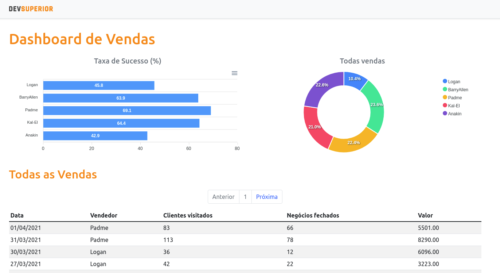

# Projeto DSVendas da DevSuperior
O projeto consiste em um Dashboard para analise de dados e controle de vendas e compradores. Foi utilizado ReactJs no Frontend e para o Backend Java com o framework Spring Boot. Foram 3 aulas com a duração média de 2 horas cada aula sob a instrução do professor [Nelio Alves](https://github.com/acenelio) da [DevSuperior](https://github.com/devsuperior).

---

Link: https://dsvendas-akamatu.netlify.app/

 
<h1 align="center">🎉 Projeto Finalizado 🎉</h1>
